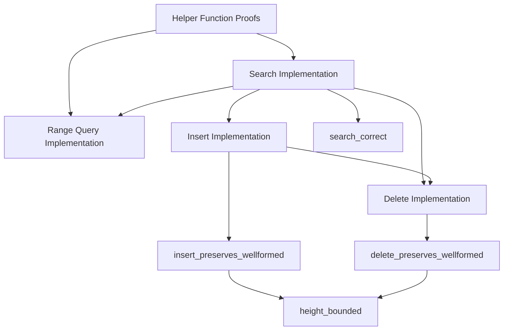

# Sorry Elimination Strategy: Dependency-Ordered Verification

## Phase 2A: Foundation Proofs (Week 3)
**Priority: CRITICAL** - These are needed by all higher-level proofs

### 2A.1: Helper Function Correctness ⭐ START HERE
- [ ] Line 143: `minKeyInSubtree_correct` - proves min returns actual minimum
- [ ] Line 148: `maxKeyInSubtree_correct` - proves max returns actual maximum  
- [ ] Line 153: `minKeyInSubtree_none_iff_empty` - proves none ↔ empty
- [ ] Line 158: `maxKeyInSubtree_none_iff_empty` - proves none ↔ empty

**Why First**: These are **foundational lemmas** needed by operation proofs. No dependencies.

## Phase 2B: Core Operations (Week 4)
**Strategy**: Simple → Complex, each operation proven before its correctness theorems

### 2B.1: Search Operation (Simplest)
- [ ] Line 189: `search` implementation
  - Recursive descent through tree
  - Use height-based termination pattern
  - Functional correctness: returns value iff key exists

### 2B.2: Range Query (Uses Search)  
- [ ] Line 198: `rangeQuery` implementation
  - Find start leaf, traverse to end leaf
  - Depends on search for leaf location
  - Easier than insert/delete (no tree modification)

### 2B.3: Insert Operation (Complex)
- [ ] Line 192: `insert` implementation
  - Node splitting when full
  - Parent key propagation  
  - Root splitting (height increase)
  - Most complex due to tree restructuring

### 2B.4: Delete Operation (Most Complex)
- [ ] Line 195: `delete` implementation
  - Node merging when underfull
  - Key redistribution between siblings
  - Root merging (height decrease)
  - Requires insert patterns + inverse operations

## Phase 2C: Correctness Theorems (Week 5)
**Dependencies**: Operations must be implemented first

### 2C.1: Operation Correctness
- [ ] Line 205: `search_correct` - search finds iff key exists
- [ ] Line 209: `insert_preserves_wellformed` - insert maintains invariants
- [ ] Line 213: `delete_preserves_wellformed` - delete maintains invariants

### 2C.2: Performance Guarantees  
- [ ] Line 219: `height_bounded` - height ≤ logarithmic bound

## Proof Strategy for Each Category

### Helper Function Proofs (2A.1)
```lean
-- Pattern: Structural induction on tree + list operations
theorem minKeyInSubtree_correct (node : BPlusNode K V order) (k : K) :
  minKeyInSubtree node = some k → ∀ k' ∈ allKeysInSubtree node, k ≤ k' := by
  intro h k' h_mem
  induction node with
  | leaf entries => 
    simp [minKeyInSubtree] at h
    cases entries with
    | nil => contradiction
    | cons kv rest => 
      simp [allKeysInSubtree] at h_mem
      -- Prove k is first element, therefore minimum
  | internal keys children ih =>
    -- Use mutual recursion + induction hypothesis
```

### Search Operation (2B.1)
```lean
-- Pattern: Height-based termination + key comparison
def search (tree : BPlusTree K V order) (key : K) : Option V :=
  searchInNode tree.root key

def searchInNode : BPlusNode K V order → K → Option V
  | BPlusNode.leaf entries => 
      entries.find? (fun kv => kv.key = key) |>.map (·.value)
  | BPlusNode.internal keys children =>
      let idx := findChildIndex keys key
      searchInNode (children.get! idx) key
```

### Insert Operation (2B.3)
```lean
-- Pattern: Insert + split propagation
def insert (tree : BPlusTree K V order) (key : K) (value : V) : BPlusTree K V order :=
  match insertInNode tree.root key value with
  | InsertResult.success newRoot => ⟨newRoot, tree.height⟩
  | InsertResult.split newRoot splitKey newSibling =>
      -- Root split: increase height
      ⟨BPlusNode.internal [splitKey] [newRoot, newSibling], tree.height + 1⟩

inductive InsertResult (K V : Type) (order : Nat)
  | success : BPlusNode K V order → InsertResult K V order
  | split : BPlusNode K V order → K → BPlusNode K V order → InsertResult K V order
```

## Dependency Graph



## Success Criteria

- [ ] **Phase 2A Complete**: All helper proofs done, no foundational sorries
- [ ] **Phase 2B Complete**: All operations implemented with termination proofs
- [ ] **Phase 2C Complete**: All correctness theorems proven
- [ ] **Final Goal**: `lake build` succeeds with ZERO sorry warnings

## Risk Mitigation

1. **Proof Complexity**: Start with simplified versions, add complexity incrementally
2. **Termination Issues**: Use established height-based pattern consistently  
3. **Dependencies**: Never work on dependent proofs before prerequisites are done
4. **Verification**: Test each proof immediately, don't batch

**Timeline**: 3 weeks total, with verified Rust generation as final deliverable.
